# Manual Power Limit Adjustment on FusionSolar

This guide explains how to manually adjust the power limit on a Huawei FusionSolar SmartLogger device through the web interface.

## Prerequisites

- FusionSolar account credentials with access to the plant
- Access to https://eu5.fusionsolar.huawei.com

## Step-by-Step Instructions

### 1. Log in to FusionSolar

Navigate to https://eu5.fusionsolar.huawei.com/unisso/login.action

Enter your username and password, then click **Log In**.

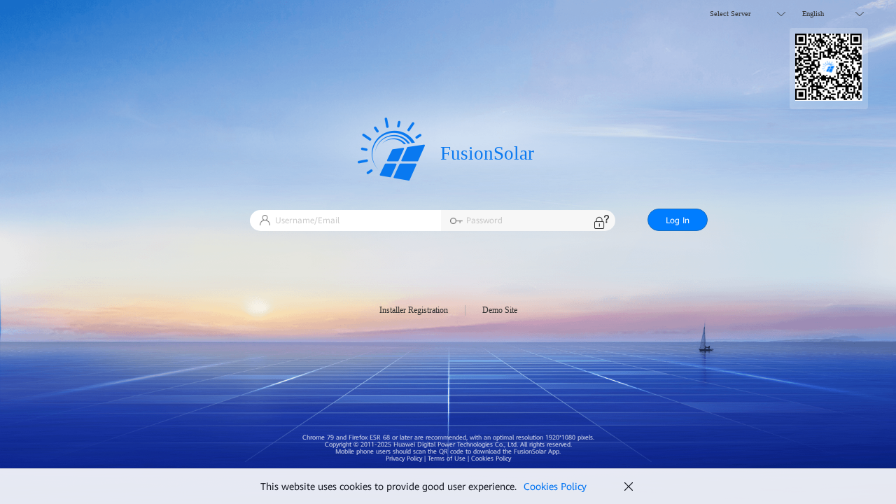

After successful login, you'll land on the FusionSolar dashboard.

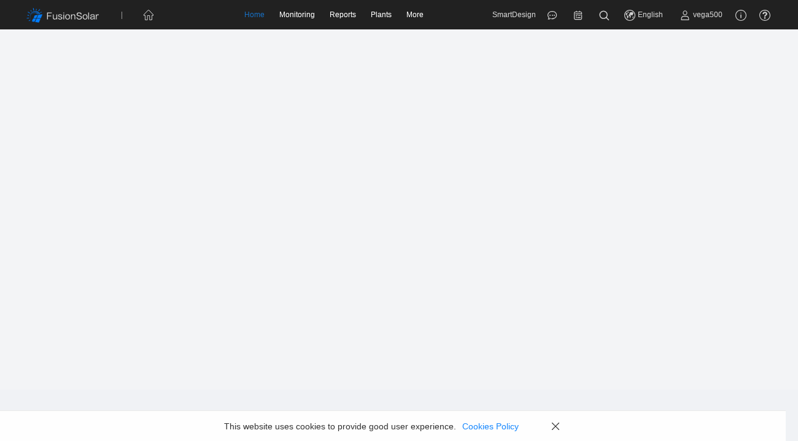

### 2. Navigate to Device Management

From the top navigation bar under **Monitoring**, click on **Device Management**.

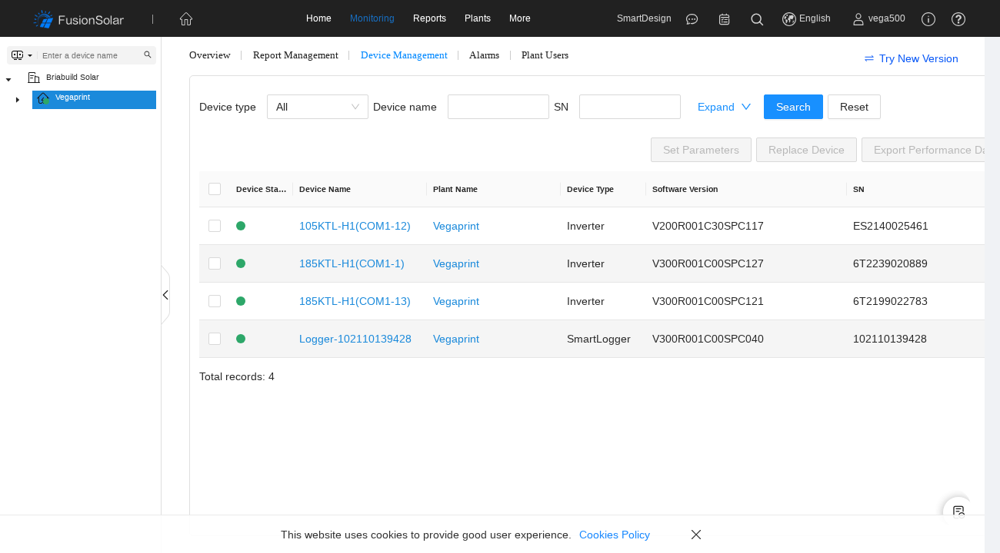

### 3. Select the SmartLogger Device

In the device list, locate the row with Device Type **SmartLogger** and click the checkbox to select it.

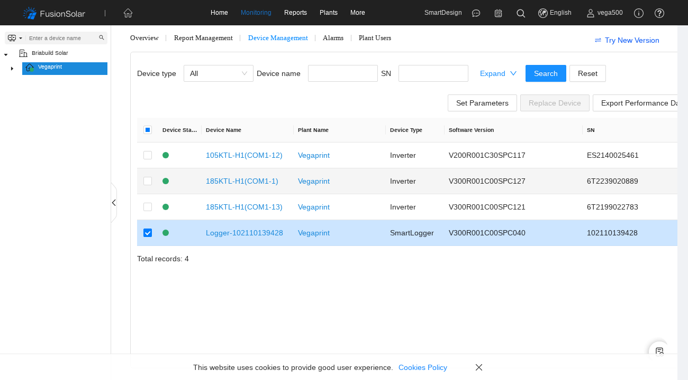

### 4. Open Set Parameters Dialog

With the SmartLogger selected, click the **Set Parameters** button above the device table.

A dialog will open showing the Parameter Settings for the Smart Logger.

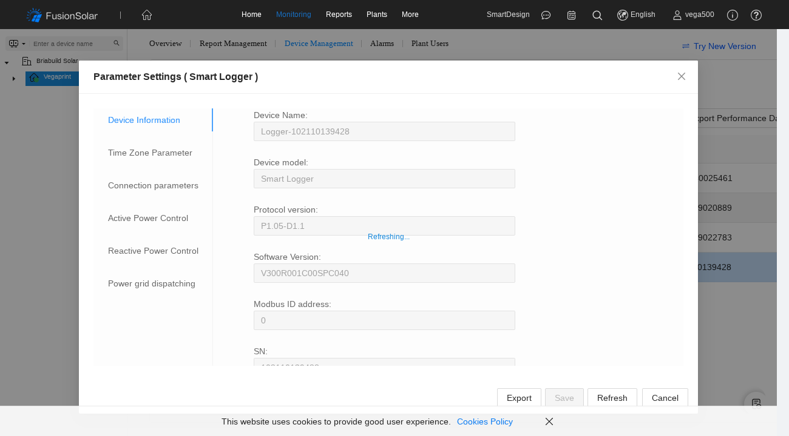

### 5. Go to Active Power Control Tab

In the left sidebar of the dialog, click on **Active Power Control**.

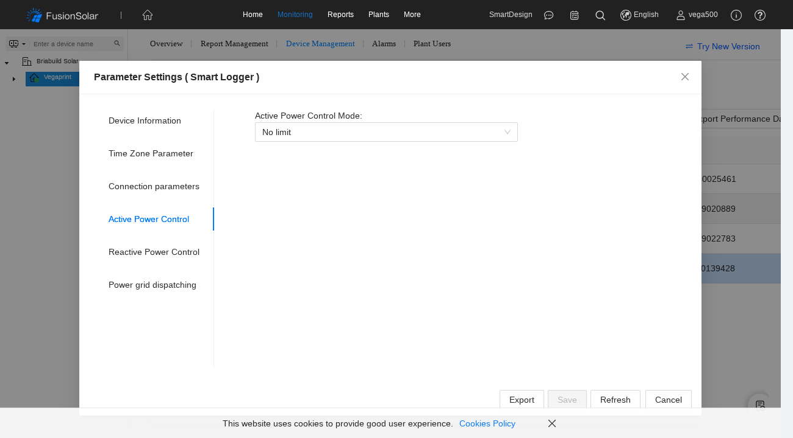

### 6. Select Power Control Mode

Click on the **Active Power Control Mode** dropdown. You'll see three options:

- **No limit** - Inverter operates at full capacity
- **Remote communication scheduling** - Power controlled by external system
- **Limited Power Grid (kW)** - Manually set a specific power limit

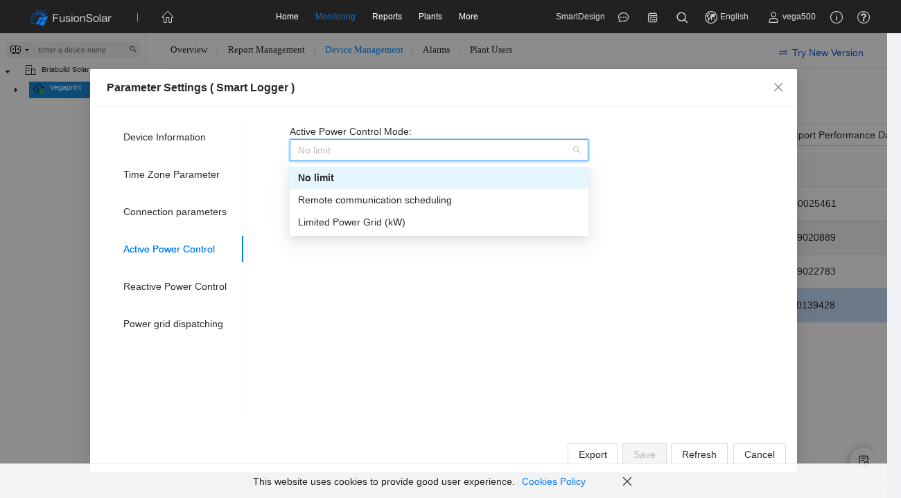

### 7. Configure Limited Power (if setting a limit)

If you select **Limited Power Grid (kW)**, additional fields will appear:

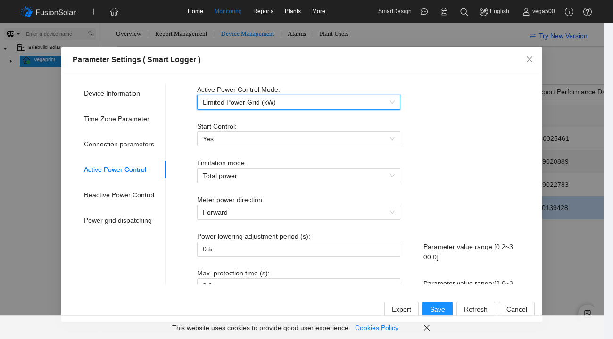

Configure the following:

| Field | Description | Recommended Value |
|-------|-------------|-------------------|
| **Start Control** | Enable power limiting | Yes |
| **Limitation mode** | How to limit power | Total power |
| **Meter power direction** | Direction of power flow | Forward |
| **Power lowering adjustment period (s)** | How quickly to reduce power | 0.5 |
| **Max. protection time (s)** | Protection timeout | 3.0 |

Scroll down to find **Max. grid feed-in power (kW)** - this is the main power limit value:

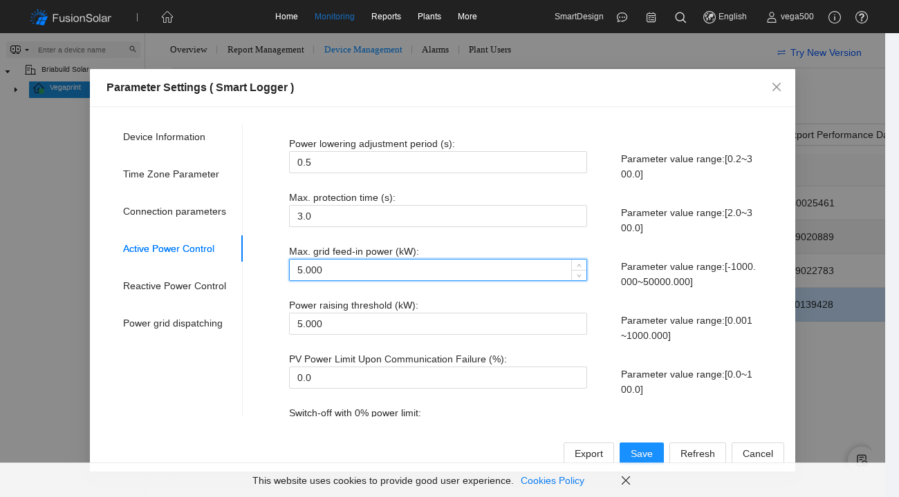

Enter your desired power limit in kW (e.g., `5.000` for 5 kW, `7.000` for 7 kW).

### 8. Save the Settings

Once configured, click the **Save** button. The button will show a loading indicator while the settings are being sent to the device.

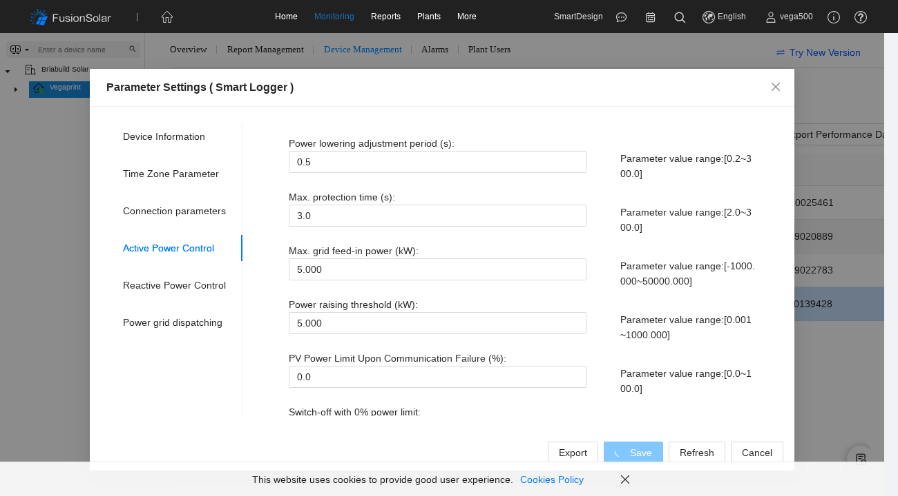

### 9. Wait for Confirmation

Wait for the "Operation succeeded" confirmation dialog. This may take up to 2 minutes as the settings are communicated to the physical device.

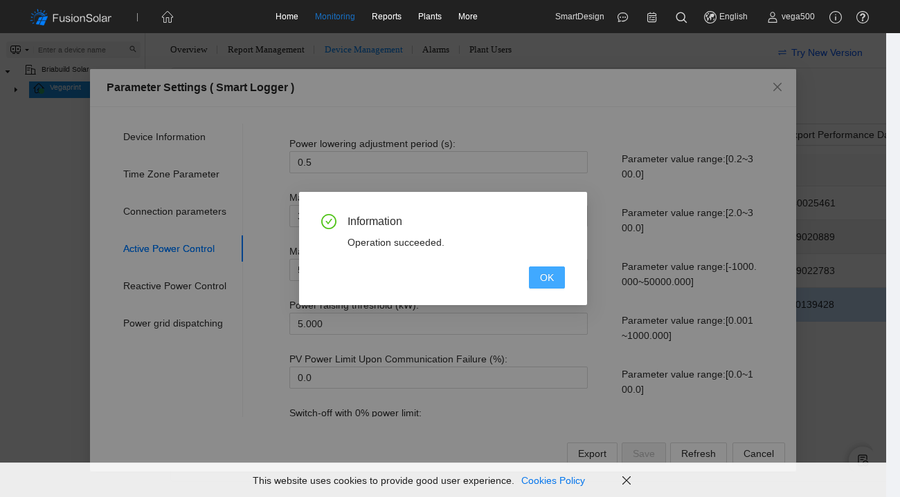

Click **OK** to close the dialog.

## Setting "No Limit" (Full Power)

To remove power limitations and allow the inverter to operate at full capacity:

1. Follow steps 1-5 above
2. In the **Active Power Control Mode** dropdown, select **No limit**
3. Click **Save**
4. Wait for confirmation

## Troubleshooting

### Save button is disabled
The Save button remains disabled if you haven't changed any values. Make sure you've actually modified a setting.

### Operation times out
The SmartLogger must be online and communicating. Check:
- Device status shows green (online) in the device list
- Network connectivity to the device

### Settings don't take effect
After saving, it may take a few minutes for the inverter to apply the new power limit. The actual power output also depends on available solar irradiance.

## Notes

- Power limits are in **kW** (kilowatts)
- The valid range for Max. grid feed-in power is -1000.000 to 50000.000 kW
- Changes take effect immediately after the SmartLogger receives them
- The SmartLogger communicates with connected inverters to enforce the limit
